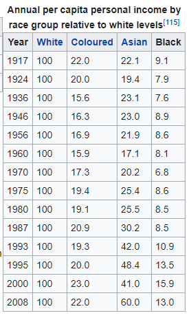

```{r setup, include=FALSE}
options(htmltools.dir.version = FALSE)
```


# What's the Hurry?

--

- Quick Exploratory Take

???
why not use existing tools like rvest
Can switch to if want more reproducible
Dont want students first exposure to be function with curly brackets
they have done copy and paste before

--

- Pique Student Interest

--

- ...or maybe you have this kinf of boss...


---

 

---

# R to the Rescue

* tidyverse
* plotly
* datapasta (functions in Rstudio Addins)

???
All libraries must be installed
tidyverse - all familiar with will use couple of core packages
plotly - interactive graphics ggplot++
Show addins for
Pronunciation of datapasta
Miles McBain based in Brisbane

---
class: center, middle


--

## Time for a Demo

???
Now it is time for a demo
Fingers crossed


---
class: center, middle

In [Economy of South Africa wiki page](https://en.wikipedia.org/wiki/Economy_of_South_Africa)



???
When in South Africa
No desire to be political - just illustration no delving into further
Actually a chart on main South Africa page somewhat similar

---

```{r copy_paste, message=FALSE,warning=FALSE}

library(tidyverse)
library(plotly)

title <- "Annual per capita personal income by race group<br> relative to white levels"
df <- data.frame(
              Year = c(1917L, 1924L, 1936L, 1946L, 1956L, 1960L, 1970L, 1975L, 1980L,
                       1987L, 1993L, 1995L, 2000L, 2008L),
             White = c(100L, 100L, 100L, 100L, 100L, 100L, 100L, 100L, 100L, 100L,
                       100L, 100L, 100L, 100L),
          Coloured = c(22, 20, 15.6, 16.3, 16.9, 15.9, 17.3, 19.4, 19.1, 20.9, 19.3,
                       20, 23, 22),
             Asian = c(22.1, 19.4, 23.1, 23, 21.9, 17.1, 20.2, 25.4, 25.5, 30.2, 42,
                       48.4, 41, 60),
             Black = c(9.1, 7.9, 7.6, 8.9, 8.6, 8.1, 6.8, 8.6, 8.5, 8.5, 10.9, 13.5,
                       15.9, 13)
      )


# backup if required
#df <- read_csv("saData.csv")
#title<- "Annual per capita personal income by race group<br> relative to white levels"

```

---

```{r dataframe}
df
 
```

Not in tidy format

---


```{r tidy}


df_tidy<- df %>% 
  select(-White) %>% 
  gather(key="race",value="index",-Year)

head(df_tidy)

```

Looks good

Let's plot the results

---
```{r}

df_tidy  %>% 
  plot_ly(x=~Year,y=~index,color=~race) %>% 
  add_lines() %>% 
  layout(title=title)

```

---
class: center, middle

 

---
.pull-left[

Me:
  
Twitter: @pssguy

Blog: http://mytinyshinys.com 

Slides https://github.com/pssguy/satRday]

.pull-right[

Resources:

datapasta: https://github.com/MilesMcBain/datapasta

plotly: https://cpsievert.github.io/plotly_book/

tidyverse: https://www.tidyverse.org/

 ]

